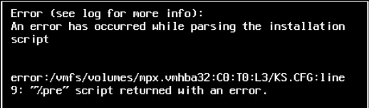
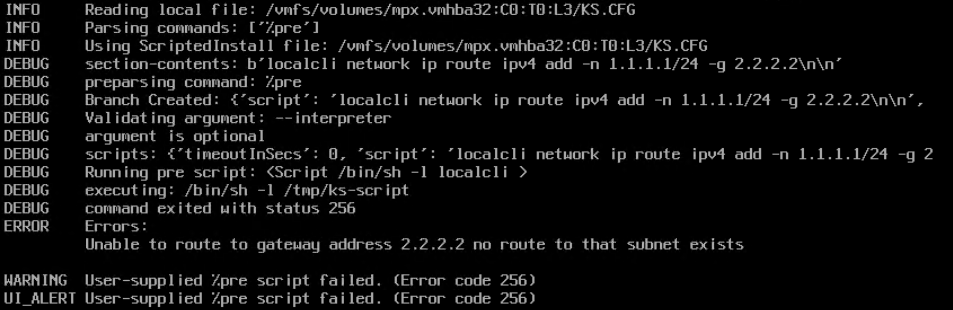

# ESXi Auto-Installer

ESXi Auto-Installer makes it easy to mass install ESXi hosts while assigning each host a unique IP address and enables SSH through a simple web-based GUI or via automation APIs.\
ESXi Auto-Installer can be used for both physical servers and virtual machines by leveraging PXE boot to install ESXi.\
For Cisco UCS Severs (except B series) you can install ESXi using the Cisco IMC instead of PXE. This is simpler and generally more reliable than PXE boot installs. 

ESXi Auto-Installer will:
- Install the ESXi Operating System on a physical or virtual server.
- Configure the ESXi Management interface with a unique IP address.
- Enable SSH (optional).

ESXi Auto-Installer API's enables you to completely automate host installations. The API's also allow you to query the installation progress so you can automatically launch your ESXi configuration scripts once the server installation is complete.

## Features
- Start deployment on multiple servers in parallel.
- Supports custom ESXi installation ISOs.
- Supports iSCSI boot installs.
- [Web APIs for additional automation](https://ciscodevnet.github.io/esxi-auto-installer/).
- Reports the installation progress for each server.
- Fully automated installs on Cisco UCS Servers (excluding B series) via Cisco IMC.
- Install ESXi into any platform, including virtual machines, using PXE boot.

# Setup guide

## Pre-requisites

ESXi Auto-Installer requires Linux or “Unix-like” system with few additional components installed.\
These install instructions were created using Ubuntu 20.04.2 LTS.

## Initial Setup

``` bash
sudo apt update
sudo apt install git ca-certificates curl gnupg lsb-release python3-pip -y

# Install Docker Engine
# Follow steps described on https://docs.docker.com/engine/install/
# Example code for Ubuntu:
curl -fsSL https://download.docker.com/linux/ubuntu/gpg | sudo gpg --dearmor -o /usr/share/keyrings/docker-archive-keyring.gpg
echo "deb [arch=$(dpkg --print-architecture) signed-by=/usr/share/keyrings/docker-archive-keyring.gpg] https://download.docker.com/linux/ubuntu \
  $(lsb_release -cs) stable" | sudo tee /etc/apt/sources.list.d/docker.list > /dev/null
sudo apt update
sudo apt install docker-ce docker-ce-cli containerd.io -y

# Install Docker Compose
# Follow steps described on https://docs.docker.com/compose/install/
# Example code for Ubuntu:
sudo curl -L "https://github.com/docker/compose/releases/download/1.29.2/docker-compose-$(uname -s)-$(uname -m)" -o /usr/local/bin/docker-compose
sudo chmod +x /usr/local/bin/docker-compose

# Install required python libraries
sudo pip3 install netifaces jinja2

# get the latest ESXi Auto-Installer code
sudo git clone https://github.com/CiscoDevNet/esxi-auto-installer /opt/eai

# start the application
cd /opt/eai/auto-installer_docker
sudo ./run_docker.sh 
```

If you want to use a custom directory, see [Custom install directory](#Custom-install-directory)

# Usage

Point a web browser at the system where ESXi Auto-Installer running.

## First task: Upload ISO

ESXi Auto-Installer does not come bundled with an ESXi Installation ISO file.\
The first time you visit the ESXi Auto-Installer web page, you will be asked to upload an ESXi Installation ISO.
Click the Browse button on this page to locate an ISO on your local machine.\
After selecting a valid ESXi Installation ISO file, click Submit.

Once the ISO is uploaded, you will be directed to the Home page.

## Home page

\
The Home page is where you start your ESXi Installations.\
In 'Step 1' is where you setup your basic installation settings.\
In 'Step 2' you configure the IP settings for the ESXi hosts.

Once all the correct settings have been entered, click the "START" button on the bottom to begin the installation process.\
Once you click Start, you will be sent to the "Status Page".

## Status page

\
You can navigate to the Status Page at any time by clicking "Status" on the top menu bar.\
The status page shows a history of all the installs.\
You can quickly see a server's current install status in the "Status" column.\
If you want to see the logs for a particular install, you can click on the link in the "Hostname" column.

## Upload ISO page

\
You can use the Upload ISO page to upload ESXi Installation ISOs. This is useful if you need a particular version of ESXi, or an ISO that contains custom drivers.\
Once you upload an ISO, you can select it as part of the install process on the Home Page.

## API page

\
The API page shows the Swagger documentation for the APIs. You do not have to authenticate to use the APIs.

You can also view the [Swagger Document in on Git](https://ciscodevnet.github.io/esxi-auto-installer/).

### Ansible Example
An example Ansible Playbook that installs ESXi via the ESXi Auto-Installer APIs is included in this repo.\
To run the Ansible Playbook example, download the [ansible-playbook.yml](ansible-playbook.yml) and [ansible-inventory.yml](ansible-inventory.yml) files.
Edit the `ansible-inventory.yml` file and put your server(s) information in place of the example values.\
Then run:
``` bash
ansible-playbook -i ansible-inventory.yml ansible-playbook.yml
```

# Application Details

## Log files

The main ESXi Auto-Installer log file `eai.log` is stored under `EAILOG` and provides overview on application run and launched jobs.

'Per job ID' log files are stored in `LOGDIR` directory and available via web GUI ('Status' tab) or from the host system. These logs provide detailed output from all tasks executed per given job ID.

## Custom install directory
`/opt/eai` is the default directory. If you use a different directory, you need to update some config files.
- the `WORKDIR` path located in the `config.py` file.
- All `/opt/eai` references in the following files:
```
./auto-installer_docker/run_docker.sh
./auto-installer_docker/nginx/project.conf
./auto-installer_docker/docker-compose.yml
./auto-installer_docker/auto-installer_flask/Dockerfile
```

## Optional Configuration

ESXi Auto-Installer Flask application configuration is stored in `config.py` file, where the following defaults can be customized:
- Main ESXi Auto-Installer directory (`WORKDIR`) and essential subdirectories
- ESXi ISO directory
- Temporary directories used during ISO upload or for storing custom installation ISO
- Toggle "dry-run", i.e. do not run any CIMC action or installation but simulate application flow
- Application status codes dictionary

## Module details

ESXi Auto-Installer is a [Flask](https://flask.palletsprojects.com) based application written in Python running in Ubuntu [Docker](https://www.docker.com/) container behind nginx container web proxy. Ubuntu Docker image has been used instead of official Python image as the latter is missing genisoimage command EFI related flags.
Additionally, it uses [Python SDK for Cisco IMC](https://github.com/CiscoUcs/imcsdk) for running tasks on Cisco UCS IMC.

## CIMC vs PXE installations
CIMC: If you have a Cisco UCS Server (except UCS B series), generally the CIMC installation method is simpler and more reliable.
- Do not need access to the ESXi Mgmt Interface, so it works even on VLAN Trunking ports.
- Reliable, even if your ESXi host is in a different subnet.
- Automatically reboots the host.
- Can onl ybe used on Cisco Servers (Execpt UCS B series)

PXE: For all other systems, including Virtual Machines and Cisco UCS B series servers, you can use the PXE boot method.
- Sometimes requires network changes before DHCP works. This is where most problems with PXE install method come from.
- Need to know the MAC address of your Mgmt NIC.
- After submitting the request to ESXi Auto-Installer, you need to reboot the target host.
- Fast installs, especially over 40GB NICs.
- Can be used on any server, including virtual machines.

## Common issues / FAQ

### What network ports are required?

Inbound to AutoInstaller:
- TCP 80 for HTTP access to the Web GUI and APIs, plus ISO downloads for OOBM/CIMC.
- UDP 67 for DHCP during PXE installations.
- UDP 69 for TFTP access to download ISO and install files during PXE installations.\
Note, TFTP data transfer happens on a random UDP port number.

Outbound from AutoInstaller:
- UDP 68 for DHCP during PXE installations.
- TCP 443 for HTTPS to enable SSH service on ESXi Host and to connect to OOBM/CIMC.
- UDP Random Port for TFTP data transfer.

### ESXi hosts status does not change to finished.
The kickstart file instructs the host to contact the ESXi Auto-Installer via the /api/v1/jobs PUT API to update its status to "Finished".\
If the ESXi host installed successfully, but the status on Auto-Installer did not update to "Finished", it could be because the ESXi host was unable to contact the Auto-Installer during the initial ESXi boot.

Common reasons are wrong IP Address, Gateway, VLAN or VMNIC settings. Or the ESXi host may require a static route, or you may be required to open a port on your firewall.
If the ESXi host is in an isolated network and there is no way for it to contact the Auto-Installer, then it cannot update the status to finished.

### There is a problem with the kickstart file, how do I troubleshoot it?
If you get the error similar to:\

```
An error has occurred while parsing the installation script

error:/vmfs/volumes/mpx.vmhba32:c0:t0:l3/KS.CFG:line
```
Then something is wrong with the kickstart file. ESXi Auto-Installer generates the kickstart file based on the data provided to start an installation. Sometimes there is an unforeseen configuration issue or typo that causes the kickstart to fail and you need to find out why.
During the installation, when you see the kickstart error, use the following steps to identify the root cause.

 1. Take a note of the error and the line number.
 2. You can view the content of the kickstart file on the ESXi Auto-Installer's Status page. Usually you can spot the error by just reviewing the kickstart content.
 3. If the error is still not understood, then check the logs on the ESXi host.\
 To do this, go to the ESXi Console. While the error is displayed on the screen, press ALT+F1 to enter the command line mode.
 4. Login with user name `root` and no password.
 5. `cd /var/log`
 6. `vi weasel.log`
 7. Review the file for clues about what went wrong.

Here is an example of a bad route in the %pre section:


### Can I copy the ISO filename out (for automation)?
At the moment, the easiest way to get the exact ISO filenames is to:
- Go to the API page on the top navigation bar.
- Under the **iso** header, click on the "GET **/isos**" section to open it.
- Click on the "Try it out" button.
- Click on the blue "Execute" button.

This will print a list of the current ISO file names that you can copy.

### PXE Install: Which MAC address do I enter?
Your servers often have multiple NICs, each with one or more MAC addresses.\
The MAC address you add to Auto-Installer should be the MAC address of the NIC that will become your ESXi Mgmt Interface. This card needs to be configured to PXE Boot.

### PXE Install: After submitting a job to ESXi Auto-Installer, nothing happens to my server.
Unlike the OOB install methods like CIMC, when using the PXE Installation method you must reboot the host yourself. In PXE Installs, Auto-Installer passively waits for the DHCP request from the host when the host attempts to PXE boot.

### PXE Install: My ESXi host is on a different subnet, can I still use the PXE install method?
On it's own, a DHCP broadcast only works on the local layer-2 subnet. However, routers/gateways have a feature called `IP Helper` or `DHCP Relay`. This feature can forward the DHCP request from a host in one subnet to a DHCP server in another subnet. If you configure this feature on the subnet where your host is located with the IP address of your ESXi Auto-Installer, Auto-Installer will be able to install into any host on that subnet.

### PXE Install: My host does not PXE boot even though Auto-Installer is in the same subnet.
Routers/gateways have a feature called `IP Helper` or `DHCP Relay`. If this is configured on the local subnet some multilayer switches will not broadcast the DHCP request onto the local subnet.\
Workaround: Add ESXi Auto-Installer to the list of the IP Helper/DHCP Relay addresses. Or remove the IP Helper/DHCP Relay feature all together.

### PXE Install: My ESXi Mgmt interface is on a trunked port with VLAN tagging. Can I use Auto-Installer?
For physical hosts, if you need VLAN tagging on your ESXi Mgmt Interface, you can configure your VLAN Trunk with a Native VLAN. If you set the Native VLAN to the ESXi Mgmt Interfaces VLAN, then the ESXi Mgmt Interface will operate without a VLAN tag (while still permitting tagging for other VLANs).\
This allows DHCP broadcasts to work during the PXE boot phase so Auto-Installer will work.\
Native VLAN is configured on the switch interface that your ESXi Mgmt Interface is plugged into. So you may need support from your network team.\
If you have a VLAN Trunk, but do not use Native VLAN, generally you cannot use Auto-Installer PXE installations. This is because most NIC cards do not support VLAN tagging during the PXE boot phase. However, some more advanced cards do support VLAN tagging at boot time. If so, you have to configure the card for VLAN tagging in your servers BIOS or Out-Of-Band-Management.\
\
For Virtual Nested ESXi hosts, as long as you are not trunking down to the VM, you can place Auto-Installer in a portgroup with the same VLAN tag and it will work.

### Using the Static Routes feature causes my installation to fail.
Currently, the static routes feature is not meant for routes related to the management IP address after the ESXi host is installed. It's designed to help with certain storage connectivity issues that can come up during the ESXi installation process.
For now, "standard" IP Static Routing will need to apply those outside of the ESXi Auto-Installer after your installation is complete.

NOTE: The Static Route feature is incompatible with Secure Boot. If you plan to use the Static Route feature, ensure Secure Boot is disabled on the server before you start.

Here is a more in-depth explanation:\
The static routes are applied during the %pre phase of the kickstart process. This is before the Mgmt IP address is assigned. Thus, you cannot use a static route that references a gateway accessible only by the Mgmt IP address.
The static routes are intended for IP interfaces that come up during the server BIOS/POST. For example, a hardware iSCSI adapter will initialize an IP address during POST. The adapter may have its own default gateway specified. However, when the Mgmt IP address is applied, it's default gateway will overwrite any default gateway assigned during the POST phase. This can cause the iSCSI adapter to loose connectivity to the remote storage.
To avoid this scenario, static routes are applied before the Mgmt IP default gateway is applied. This enables the iSCSI adapter to maintain connectivity to storage after the Mgmt IP default gateway gets applied.

### When will you add an option to configure the ESXi feature I need?
The ESXi Auto-Installer is specifically designed to be minimalistic, focusing only on the installation of ESXi and basic connectivity. There are many other tools that can already configure ESXi **once it's online**. You're expected to use a different tool to configure ESXi after ESXi Auto-Installer brings the server online.

> This project is not about replace existing tools, it's about enabling them.

Thus, the ESXi Auto-Installer project will not contain configuration options. The big exception to this rule is enabling the SSH service. This is because a lot of tools require SSH in order to connect to ESXi.

Instead of add features to configuration ESXi, this project will focus on automation feature so it can be used by existing tools.
