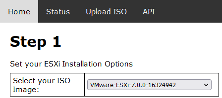
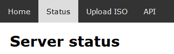
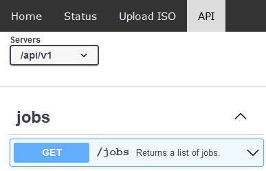

# ESXi Auto-Installer

ESXi Auto-Installer automates bare-metal ESXi hypervisor deployment, providing 100% hands-off installation on Cisco UCS physical servers.

ESXi Auto-Installer will:
- Install the ESXi Operating System on a Cisco Server.
- Configure the ESXi Management interface with an IP address.
- Enable SSH

After Auto-Installer is complete, you can use your traditional automation methods to configure the ESXi Host.

## Features
- Start deployment on multiple servers in parallel (using same CIMC credentials)
- Supports custom ESXi installation ISO
- Implements most kickstart parameters described in [VMWare's documentation](https://docs.vmware.com/en/VMware-vSphere/7.0/com.vmware.esxi.upgrade.doc/GUID-61A14EBB-5CF3-43EE-87EF-DB8EC6D83698.html)
- Supports iSCSI boot installs
- [API for additional automation](https://ciscodevnet.github.io/esxi-auto-installer/)
- Future: Platform agnostic installations (including virtual machines) using PXE boot

# Setup guide

## Pre-requisites

ESXi Auto-Installer requires Linux or “Unix-like” system with few additional components installed.\
The install instructions were created using Ubuntu 20.04.2 LTS.

## Initial Setup

``` bash
sudo apt update && \
sudo apt install python3-pip git apache2 apache2-dev libapache2-mod-wsgi-py3 genisoimage -y && \
sudo a2enmod wsgi && \
sudo git clone https://github.com/CiscoDevNet/esxi-auto-installer /opt/eai && \
sudo chown -R www-data.www-data /opt/eai && \
cd /opt/eai && \
sudo pip install -r requirements.txt && \
sudo cp autoinstaller.conf /etc/apache2/sites-available/ && \
sudo ln -s /etc/apache2/sites-available/autoinstaller.conf /etc/apache2/sites-enabled/autoinstaller.conf && \
sudo unlink /etc/apache2/sites-enabled/000-default.conf && \
sudo /bin/sh -c 'echo "www-data ALL=NOPASSWD:/usr/bin/mount, /usr/bin/umount, /usr/bin/mkdir, /usr/bin/chown, /usr/bin/rmdir" > /etc/sudoers.d/apache' && \
sudo systemctl enable apache2 && \
sudo systemctl restart apache2
```

If you want to use a custom directory, see [Custom install directory](#Custom-install-directory)

# Usage

Point a web browser at the system where Auto-Installer running.

## First task: Upload ISO

Auto-Installer does not come bundled with an ESXi Installation ISO file. Before you can use Auto-Installer you must upload an ESXi Installation ISO file.\
From the main page click on "Upload ISO" in the top menu bar.\
Click Browse to locate an ISO on your local machine.\
After selecting a valid ESXi Installation ISO file, click Submit.

Now that an ISO is uploaded, you can go back to the "Home Page".

## Home page

\
The Home page is where you start your ESXi Installations.\
In 'Step 1' is where you setup your basic installation settings.\
In 'Step 2' you configure the IP settings for the ESXi hosts.

Once all the correct settings have been entered, click the "START" button on the bottom to begin the installation process.\
Once you click Start, you will be sent to the "Status Page".

## Status page

\
You can navigate to the Status Page at any time by clicking "Status" on the top menu bar.\
The status page shows a history of all the installs.\
You can quickly see a server's current install status in the "Status" column.\
If you want to see the logs for a particular install, you can click on the link in the "Hostname" column.

## Upload ISO page

\
You can use the Upload ISO page to upload ESXi Installation ISOs. This is useful if you need a particular version of ESXi, or an ISO that contains custom drivers.\
Once you upload an ISO, you can select it as part of the install process on the Home Page.

## API page

\
The API page shows the Swagger documentation for the APIs. You do not have to authenticate to use the APIs.

You can also view the [Swagger Document in on Git](https://ciscodevnet.github.io/esxi-auto-installer/).

# Application Details

## Log files

Main Auto-Installer log file `eai.log` is stored under `EAILOG` and provides overview on application run and launched jobs.

'Per job ID' log files are stored in `LOGDIR` directory and available via web GUI ('Status' tab) or from the host system. These logs provide detailed output from all tasks executed per given job ID.

## Custom install directory
`/opt/eai` is the default directory. If you use a different directory, you need to update some config files.
- the `WORKDIR` path located in the `config.py` file.
- All `/opt/eai` entries in `/etc/httpd/conf.d/autoinstaller.conf`

## Optional Configuration

All Auto-Installer configuration is stored in `config.py` file, where the following defaults can be customized:
- Main Auto-Installer directory (`WORKDIR`) and essential subdirectories
- ESXi ISO directory
- Temporary directories used during ISO upload or for storing custom installation ISO
- Toggle "dry-run", i.e. do not run any CIMC action and installation but simulate application flow
- Application status codes dictionary

## Module details

Auto-Installer is a [Flask](https://flask.palletsprojects.com) based application written in Python running behind Apache web server through [mod_wsgi](https://pypi.org/project/mod-wsgi/).
Additionally, it uses [Python SDK for Cisco IMC](https://github.com/CiscoUcs/imcsdk) for running tasks on Cisco UCS IMC.

## Common issues

### My server reboots, but does not install ESXi
ESXi Auto-Installer mounts the ESXi ISO to your Cisco Server via IMC. But after it reboots your server, it's up to the boot order to decide whether or not the server will boot off the Virtual DVD Drive.
Your Cisco server Boot Order can be set to 'basic mode' or 'advanced mode'.\
If your server is in 'advanced mode', Auto-Installer attempts to set the Virtual DVD drive as a One-Time Boot Device.\
If your Cisco server Boot Order is set to 'basic mode', it does not support the One-Time Boot Device feature. In this case you need to ensure that CDROM boot option is near the top, usually before the HDD and PXE boot options.

### ESXi hosts status does not change to finished
The kickstart file instructs the host to contact the Auto-Installer via the /api/v1/jobs PUT API to update its status to "Finished".\
If the ESXi host installed successfully, but the status on Auto-Installer did not update to "Finished", it could be because the ESXi host was unable to contact the Auto-Installer during the initial ESXi boot.

Common reasons are wrong IP Address, Gateway, VLAN or VMNIC settings. Or the ESXi host may require a static route.
If the ESXi host is in an isolated network and there is no way for it to contact the Auto-Installer, then it cannot update the status to finished.

### Using the Static Routes feature causes my installation to fail
Currently, the static routes feature is not meant for routes related to the management IP address after the ESXi host is installed. It's designed to help with certain storage connectivity issues that can come up during the ESXi installation process.
For now, "standard" IP Static Routing will need to apply those outside of the ESXi Auto-Installer after your installation is complete.

Here is a more in-depth explanation:\
The static routes are applied during the %pre phase of the kickstart process. This is before the Mgmt IP address is assigned. Thus, you cannot use a static route that references a gateway accessible only by the Mgmt IP address.
The static routes are intended for IP interfaces that come up during the server BIOS/POST. For example, a hardware iSCSI adapter will initialize an IP address during POST. The adapter may have its own default gateway specified. However, when the Mgmt IP address is applied, it's default gateway will overwrite any default gateway assigned during the POST phase. This can cause the iSCSI adapter to loose connectivity to the remote storage.
To avoid this scenario, static routes are applied before the Mgmt IP default gateway is applied. This enables the iSCSI adapter to maintain connectivity to storage after the Mgmt IP default gateway gets applied.

### When will you add an option to configure the ESXi feature I need?
The ESXi Auto-Installer is specifically designed to be minimalistic, focusing only on the installation of ESXi and basic connectivity. There are many other tools that can already configure ESXi **once it's online**. You're expected to use a different tool to configure ESXi after ESXi Auto-Installer brings the server online.

> This project is not about replace existing tools, it's about enabling them.

Thus, the ESXi Auto-Installer project will not contain configuration options. The big exception to rule is enabling the SSH service because a lot of tools require SSH to connect to ESXi.

Instead of add features to configuration ESXi, this project will focus on automation feature so it can be used by existing tools.\
That said we do have a few things we hope to bring you in the future that may help. For example, we want you to be able to add scripts that run on first boot. This should provide flexibility if you need a special configuration.
